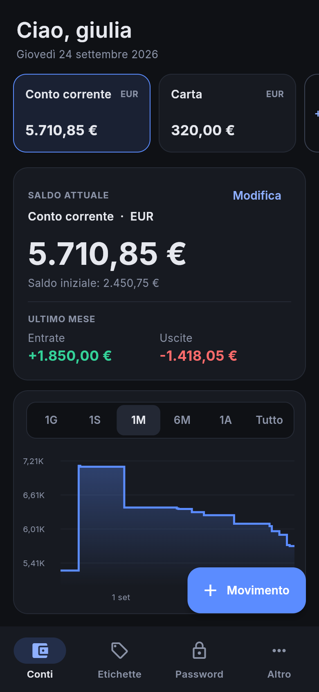
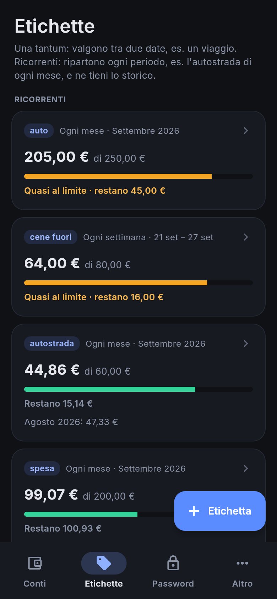
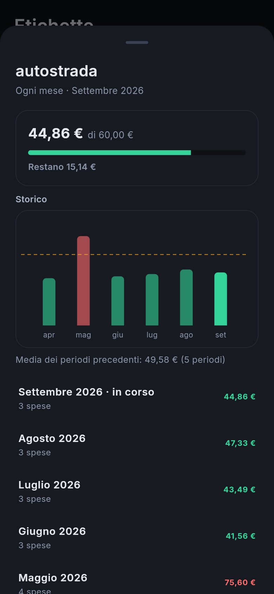
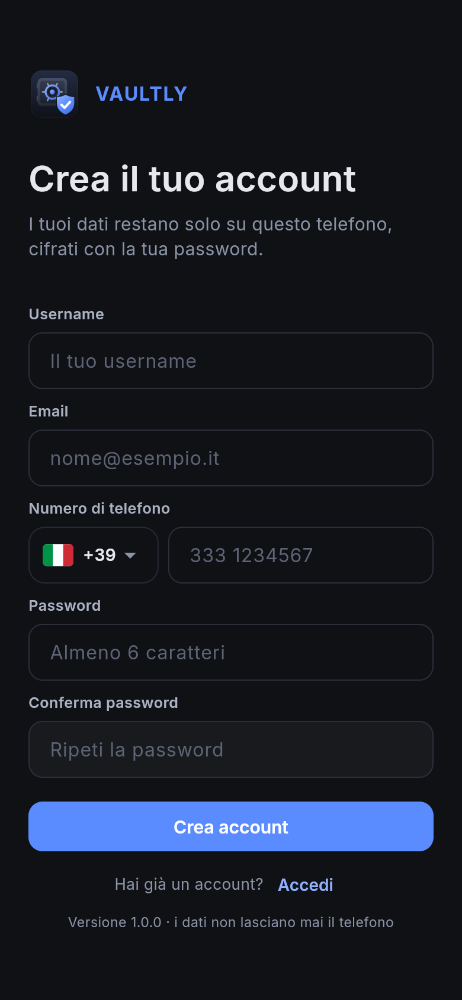
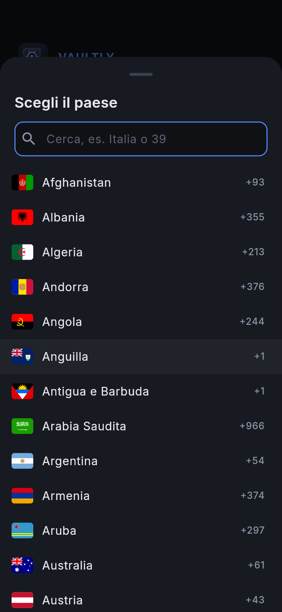
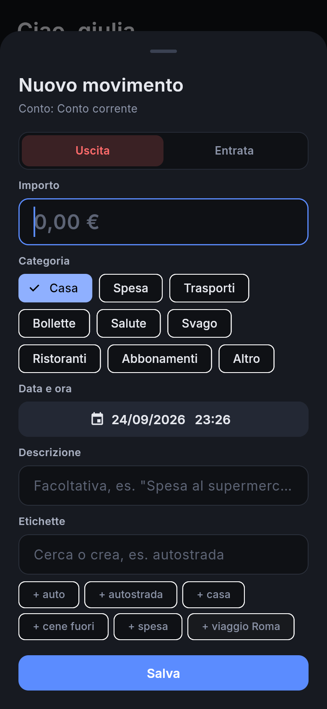
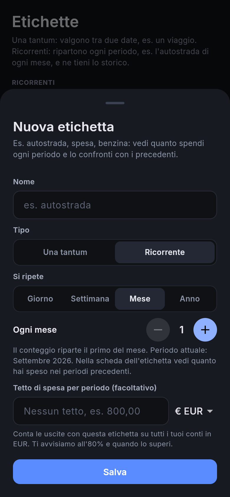
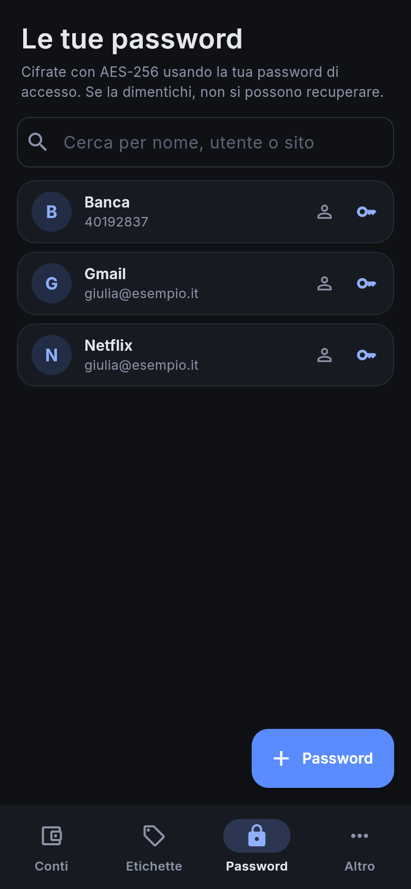
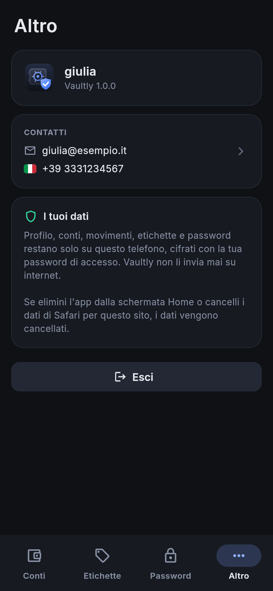

<p align="center">
  
</p>

<h1 align="center">Vaultly per telefono</h1>

<p align="center">
  Conti, spese, etichette e password sempre in tasca. Gratis, senza App Store, e i tuoi dati non lasciano mai il telefono.<br>
  <a href="https://4kumiho.github.io/VaultlyPhone/"><b>📱 Apri Vaultly: https://4kumiho.github.io/VaultlyPhone/</b></a>
</p>

<p align="center">
  
  
  
</p>

---

## Cosa fa

- **Conti**: uno o più conti (conto corrente, carta, contanti…), ognuno nella sua valuta: euro, dollaro, sterlina, franco svizzero o yen.
- **Entrate e uscite**: importo, categoria, data e ora, descrizione ed etichette.
- **Grafico del saldo**: come cambia il saldo nell'ultimo giorno, settimana, mese, 6 mesi, anno o da sempre.
- **Etichette**, di due tipi:
  - **Una tantum**, per esempio *"viaggio a Rimini"*. Durano una settimana, un mese o tra due date che scegli tu. Si possono mettere solo sulle spese fatte in quelle date.
  - **Ricorrenti**, per esempio *"autostrada"*. Ricominciano da zero ogni giorno, ogni N giorni, ogni settimana, ogni mese o ogni anno. Per ognuna vedi quanto hai speso nei periodi precedenti, con grafico e media.
  - Per ogni etichetta puoi mettere un **tetto di spesa**. Vaultly ti avvisa quando arrivi all'80% e quando lo superi.
- **Password**: login e password dei tuoi account, cifrati, con un generatore di password sicure. Quando copi una password, Vaultly prova a cancellarla dagli appunti dopo 30 secondi.
- **Più persone sullo stesso telefono**: ognuno ha il suo utente e vede solo i suoi dati.
- **Funziona senza internet**: basta averla aperta una volta con la connessione.

---

## I tuoi dati restano sul telefono

Vaultly è una "app web": la scarichi da un indirizzo internet, ma **tutto quello che scrivi resta nella memoria del telefono**.

- **Nessun server, nessun account online.** L'app non invia a nessuno i tuoi dati: profilo, conti, movimenti, etichette e password. Internet serve solo a scaricare l'app, cioè il codice, i caratteri e le icone.
- **Tutto è cifrato** (AES-256) con una chiave che nasce dalla tua password. Sul telefono resta in chiaro solo il tuo **username**. Senza la password, il resto sono byte illeggibili.
- **L'app non può collegarsi ad altri siti.** Una regola di sicurezza del browser (Content-Security-Policy) blocca qualsiasi collegamento esterno, anche se ci fosse un errore nel codice.
- **Il codice è pubblico**, qui su GitHub: chiunque può controllarlo.

Due funzioni dell'iPhone, non di Vaultly, possono però portare qualcosa fuori dal telefono:

1. **Salvare la password nel Portachiavi.** Quando accedi o salvi una password in Vaultly, l'iPhone può chiederti se vuoi salvarla nel Portachiavi iCloud. Se vuoi che non esca dal telefono, rispondi **Non ora**.
2. **Appunti condivisi.** Se hai un Mac o un iPad con lo stesso Apple ID e *Handoff* attivo, una password che copi può comparire anche lì. Vaultly prova a cancellarla dagli appunti dopo 30 secondi.

> ⚠️ **Non c'è recupero password e non c'è backup online.** Se dimentichi la password, i tuoi dati non si possono più aprire. Se elimini l'icona di Vaultly o cambi telefono, i dati spariscono con lei. I dati del telefono sono separati da quelli di Vaultly per PC.

---

## Installazione su iPhone

**Serve:** un iPhone e **Safari**. Da altri browser su iPhone non si può aggiungere l'app alla schermata Home nel modo giusto.

1. Apri **Safari** e vai su **https://4kumiho.github.io/VaultlyPhone/**
2. Tocca **•••** in basso a destra e poi **Condividi**. Sugli iPhone meno recenti tocca direttamente il pulsante Condividi, il quadrato con la freccia verso l'alto.
3. Nel pannello che si apre **scorri verso il basso** oltre le icone delle app e tocca **Aggiungi alla schermata Home**. Se non c'è, tocca **Modifica azioni…** in fondo all'elenco e aggiungila con il **+** verde.
   Se compare l'opzione **Apri come app web**, lasciala attiva.
4. Tocca **Aggiungi**. Sulla schermata Home compare l'icona di **Vaultly**.
5. **Apri Vaultly sempre da quell'icona**, non da Safari. L'app a schermo intero e la pagina in Safari hanno memorie separate: i dati che inserisci nell'app li trovi solo aprendola dall'icona.

La prima apertura richiede internet, per scaricare l'app. Dopo funziona anche in aereo o senza campo.

## Installazione su Android

1. Apri **Chrome** e vai su **https://4kumiho.github.io/VaultlyPhone/**
2. Tocca **⋮** in alto a destra, poi **Aggiungi a schermata Home** (o **Installa app**) e conferma.
3. Apri Vaultly dall'icona.

## Aggiornamenti

Non devi fare niente. Quando apri Vaultly con internet, l'app scarica la nuova versione, se c'è, e la usa **dalla volta successiva** che la apri. I tuoi dati non vengono toccati.

---

## Primi passi

<p align="center">
  
  
  
</p>

### 1. Crea il tuo utente

Tocca **Registrati** e compila i campi:

- **username**;
- **email**;
- **numero di telefono**: tocca la bandiera per scegliere il paese; puoi cercarlo per nome o per prefisso;
- **password**: almeno 6 caratteri, da scrivere due volte.

Email e telefono restano nel tuo profilo, cifrati, e li puoi cambiare da **Altro → Contatti**. Non vengono usati per recuperare la password: non c'è un server a cui chiederlo.

### 2. Crea un conto e registra i movimenti

Crea il primo conto con nome, valuta e saldo di oggi. Poi, per ogni spesa o entrata, tocca **+ Movimento**: importo, categoria, data ed eventuali etichette.

### 3. Usa le etichette

<p align="center">
  
</p>

Dalla sezione **Etichette** tocca **+ Etichetta**, oppure scrivi un nome nuovo mentre registri un movimento. Scegli:

- **Una tantum**: il giorno di inizio e la durata (una settimana, un mese o date libere).
- **Ricorrente**: ogni quanto ricomincia (giorno, settimana, mese, anno, anche "ogni 2 settimane" o "ogni 10 giorni").

Il **tetto di spesa** è facoltativo. Tocca un'etichetta per vederne il dettaglio: per le ricorrenti c'è lo storico dei periodi passati, e toccando un periodo vedi le spese che contiene.

### 4. Salva le tue password

<p align="center">
  
  
</p>

Nella sezione **Password** tocca **+ Password**: nome, sito, utente e password, oppure fattene generare una sicura. Dall'elenco copi utente o password con un tocco.

---

## Per chi sviluppa

App [Flutter](https://flutter.dev) (Dart) pubblicata come app web progressiva (PWA) su GitHub Pages. Il codice resta compilabile anche per Android e iOS.

| Cartella | Contenuto |
| --- | --- |
| `lib/core` | modelli, soldi, calcoli su saldo ed etichette, accesso, stato dell'app |
| `lib/data` | cifratura (PBKDF2 + AES-256-GCM) e archivio locale (IndexedDB con sembast) |
| `lib/ui` | schermate e pannelli |
| `web` | pagina, manifest, icone, regole di sicurezza (CSP), `sw.js` per l'uso offline |
| `test` | test di calcoli, cifratura, dati e schermate |

```powershell
flutter test                                                    # test
flutter run -d edge                                             # prova sul PC
flutter build web --release --no-web-resources-cdn --dart-define=VAULTLY_DEMO=true -o build/web-demo
                                                                # versione di prova con l'utente giulia / segreto1
flutter build web --release --no-web-resources-cdn --base-href /VaultlyPhone/ -o build/pages/VaultlyPhone
                                                                # versione da pubblicare
```

`--no-web-resources-cdn` è obbligatorio: senza, Flutter scarica il motore grafico (CanvasKit) da un server di Google.

La cartella `build/pages/VaultlyPhone` va pubblicata nel ramo `gh-pages`, che GitHub Pages serve all'indirizzo dell'app.
