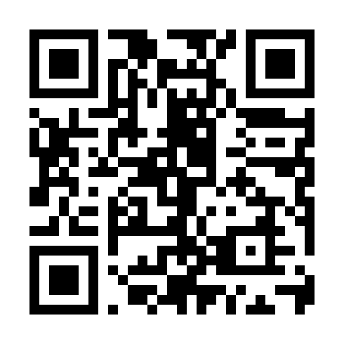
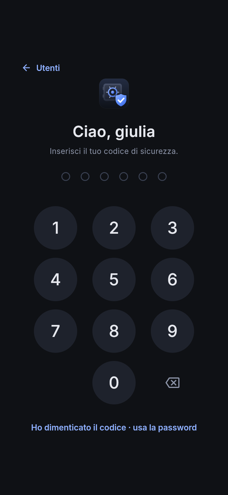
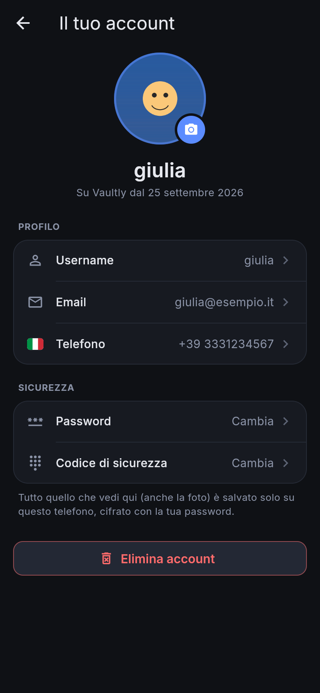

<p align="center">
  
</p>

<h1 align="center">Vaultly per telefono</h1>

<p align="center">
  Conti, spese, etichette e password sempre in tasca. Gratis, senza App Store, e i tuoi dati non lasciano mai il telefono.<br>
  <a href="https://4kumiho.github.io/VaultlyPhone/"><b>📱 Apri Vaultly: https://4kumiho.github.io/VaultlyPhone/</b></a>
</p>

## Dove vengono salvati i tuoi dati, e perché è sicura

**Tutto quello che scrivi in Vaultly resta sul tuo telefono**: profilo, conti, movimenti, etichette e password. Vaultly non ha un server e non ha account online. Nessuno, nemmeno chi ha scritto l'app, può vedere i tuoi dati.

### Dove finiscono i dati

- Vaultly è un'**app web**: si scarica da un indirizzo internet, come una pagina, ma poi funziona come un'app.
- Da internet arriva **solo l'app**: il codice, i caratteri e le icone. Sono gli stessi file per tutti e non contengono niente di tuo.
- **I dati che inserisci**, compresa la foto del profilo, vengono salvati nella **memoria interna del telefono**, nello spazio riservato all'app (il database del browser, IndexedDB). Non vengono mai spediti da nessuna parte.
- Dopo la prima apertura Vaultly **funziona anche senza internet**, in aereo o senza campo: la prova che i tuoi dati non hanno bisogno di andare online.

### Perché è sicura

1. **È tutto cifrato.** Prima di essere salvati, i dati vengono cifrati con **AES-256**, lo stesso sistema usato da banche e governi. La chiave nasce dalla tua password (PBKDF2, 100.000 passaggi) e **non viene salvata da nessuna parte**. Sul telefono resta in chiaro solo il tuo **username**; il resto, senza la password, sono byte illeggibili.
2. **Non può parlare con altri siti.** La pagina contiene una regola di sicurezza del browser (*Content-Security-Policy*) che **vieta qualsiasi collegamento esterno**. Anche se nel codice ci fosse un errore, il browser bloccherebbe l'invio.
3. **Nessuna pubblicità, nessuna statistica, nessun tracciamento.** Non ci sono servizi di terze parti: niente Google Analytics, niente Facebook, niente cookie.
4. **Il codice è pubblico**, qui su GitHub: chiunque può leggerlo e controllare che faccia davvero quello che è scritto qui.
5. **È stato verificato.** Durante lo sviluppo l'app è stata usata in tutte le sue funzioni registrando ogni richiesta di rete:
   - **zero** richieste verso altri siti, **zero** dati inviati;
   - nella memoria del telefono nessuno dei dati inseriti (nomi dei conti, importi, email, telefono, password) compare in chiaro.
6. **Ognuno vede solo i suoi dati.** Se sullo stesso telefono ci sono più utenti, ciascuno ha la sua password e i suoi dati cifrati con la sua chiave.
7. **Il codice di 6 cifre vale solo su questo telefono.** Per aprire i dati il codice da solo non basta: serve anche una **chiave del dispositivo** creata dal browser. Il browser la custodisce e **non permette a nessuno di leggerla o copiarla**, nemmeno all'app. Dopo **5 codici sbagliati** il codice si disattiva e serve la password.

### Cosa devi sapere

- **Non c'è recupero password e non c'è backup online.** È il prezzo della sicurezza: se dimentichi la password, i dati non si possono più aprire, neanche da chi ha fatto l'app. Se elimini l'icona di Vaultly o cambi telefono, i dati spariscono con lei.
- **I dati del telefono sono separati** da quelli di Vaultly per PC.
- Due funzioni dell'iPhone, non di Vaultly, possono portare qualcosa fuori dal telefono:
  1. **Portachiavi iCloud.** Quando accedi o salvi una password, l'iPhone può chiederti se vuoi salvarla nel Portachiavi iCloud. Se vuoi che non esca dal telefono, rispondi **Non ora**.
  2. **Appunti condivisi.** Se hai un Mac o un iPad con lo stesso Apple ID e *Handoff* attivo, una password che copi può comparire anche lì. Vaultly prova a cancellarla dagli appunti dopo 30 secondi.

---

## Apri Vaultly

<p align="center">
  <a href="https://4kumiho.github.io/VaultlyPhone/"></a>
</p>

> **Come aprire Vaultly sul telefono**
> - **Stai leggendo questa pagina sul PC?** Apri la **Fotocamera** del telefono, inquadra il codice QR qui sopra sullo schermo del PC e tocca il link che compare (**4kumiho.github.io**).
> - **Stai leggendo questa pagina sul telefono?** Il QR non serve: tocca il link blu **[📱 Apri Vaultly](https://4kumiho.github.io/VaultlyPhone/)**.
>
> Poi segui i passaggi di [installazione su iPhone](#installazione-su-iphone) o [su Android](#installazione-su-android).

<p align="center">
  
  
  
</p>

---

## Cosa fa

- **Conti**: uno o più conti (conto corrente, carta, contanti…), ognuno nella sua valuta: euro, dollaro, sterlina, franco svizzero o yen.
- **Entrate e uscite**: importo, categoria, data e ora, descrizione ed etichette.
- **Grafico del saldo**: come cambia il saldo nell'ultimo giorno, settimana, mese, 6 mesi, anno o da sempre.
- **Etichette**, di due tipi:
  - **Una tantum**, per esempio *"viaggio a Rimini"*. Durano una settimana, un mese o tra due date che scegli tu. Si possono mettere solo sulle spese fatte in quelle date.
  - **Ricorrenti**, per esempio *"autostrada"*. Ricominciano da zero ogni giorno, ogni N giorni, ogni settimana, ogni mese o ogni anno. Per ognuna vedi quanto hai speso nei periodi precedenti, con grafico e media.
  - Per ogni etichetta puoi mettere un **tetto di spesa**. Vaultly ti avvisa quando arrivi all'80% e quando lo superi.
- **Password**: login e password dei tuoi account, cifrati, con un generatore di password sicure. Quando copi una password, Vaultly prova a cancellarla dagli appunti dopo 30 secondi.
- **Il tuo account**: la tua foto come avatar (oppure l'iniziale su un colore a scelta), username, email, telefono, password e codice, tutto modificabile.
- **Accesso veloce con un codice di 6 cifre**: la password serve solo la prima volta. Poi scegli il tuo utente e inserisci il codice.
- **Più persone sullo stesso telefono**: ognuno ha il suo utente, il suo codice e vede solo i suoi dati.
- **Funziona senza internet**: basta averla aperta una volta con la connessione.

---

## Installazione su iPhone

**Serve:** un iPhone e **Safari**. Da altri browser su iPhone non si può aggiungere l'app alla schermata Home nel modo giusto.

1. **Apri Vaultly in Safari**, in uno di questi tre modi:
   - **dal PC**: apri questa pagina sul computer, poi sull'iPhone apri la **Fotocamera**, inquadra il codice QR qui sotto e tocca la scritta gialla **4kumiho.github.io** che compare;
   - **dall'iPhone**: se stai leggendo questa pagina sull'iPhone, tocca il link blu [📱 Apri Vaultly](https://4kumiho.github.io/VaultlyPhone/);
   - **a mano**: in Safari tocca la barra degli indirizzi, cancella tutto e scrivi **4kumiho.github.io/VaultlyPhone**, con V e P maiuscole.

   

   **Controlla di essere sulla pagina giusta** prima di andare avanti:
   - ✅ schermata **scura** con il logo di Vaultly e la scritta **"Bentornato"**: è quella giusta;
   - ❌ pagina **bianca di GitHub**, con file e testo, come questa: è la pagina del codice. Se aggiungi quella alla schermata Home, l'icona apre GitHub e non l'app.

2. Tocca **•••** in basso a destra e poi **Condividi**. Sugli iPhone meno recenti tocca direttamente il pulsante Condividi, il quadrato con la freccia verso l'alto.
3. Nel pannello che si apre **scorri verso il basso** oltre le icone delle app e tocca **Aggiungi alla schermata Home**. Se non c'è, tocca **Modifica azioni…** in fondo all'elenco e aggiungila con il **+** verde.
   Se compare l'opzione **Apri come app web**, lasciala attiva.
4. Tocca **Aggiungi**. Sulla schermata Home compare l'icona di **Vaultly**.
   Nella finestra di aggiunta, sotto il nome, l'iPhone mostra solo **4kumiho.github.io** e non l'indirizzo completo: è normale, l'icona apre comunque Vaultly. Se invece c'è scritto **github.com**, sei sulla pagina sbagliata: torna al punto 1.
5. **Apri Vaultly sempre da quell'icona**, non da Safari. L'app a schermo intero e la pagina in Safari hanno memorie separate: i dati che inserisci nell'app li trovi solo aprendola dall'icona.

La prima apertura richiede internet, per scaricare l'app. Dopo funziona anche in aereo o senza campo.

## Installazione su Android

1. Apri **Chrome** e vai su **https://4kumiho.github.io/VaultlyPhone/**, oppure inquadra il codice QR qui sopra.
2. Tocca **⋮** in alto a destra, poi **Aggiungi a schermata Home** (o **Installa app**) e conferma.
3. Apri Vaultly dall'icona.

## Aggiornamenti

Non devi fare niente. Quando apri Vaultly con internet, l'app scarica la nuova versione, se c'è, e la usa **dalla volta successiva** che la apri. I tuoi dati non vengono toccati.

---

## Primi passi

<p align="center">
  
  
  
</p>

### 1. Crea il tuo utente

Tocca **Registrati** e compila i campi:

- **username**;
- **email**;
- **numero di telefono**: tocca la bandiera per scegliere il paese; puoi cercarlo per nome o per prefisso;
- **password**: almeno 6 caratteri, da scrivere due volte.

Email e telefono restano nel tuo profilo, cifrati, e li puoi cambiare da **Altro → Contatti**. Non vengono usati per recuperare la password: non c'è un server a cui chiederlo.

### 2. Crea il codice di sicurezza

<p align="center">
  
</p>

Subito dopo, Vaultly ti chiede un **codice di 6 cifre**, da scrivere due volte. Non sono ammessi codici troppo facili come 111111 o 123456. **Da quel momento** all'apertura:

1. scegli il tuo utente, oppure, se sul telefono ci sei solo tu, arrivi direttamente al tastierino;
2. inserisci il codice e sei dentro.

- **Hai dimenticato il codice?** Tocca **Ho dimenticato il codice · usa la password**: entri con la password e poi ne crei uno nuovo.
- **Dopo 5 codici sbagliati** il codice si disattiva: accedi con la password e creane uno nuovo.
- Per **cambiarlo**: **Altro → Codice di sicurezza**.
- Per **aggiungere un'altra persona**: dalla schermata **Chi sei?** tocca **Nuovo utente**.

### 3. Crea un conto e registra i movimenti

Crea il primo conto con nome, valuta e saldo di oggi. Poi, per ogni spesa o entrata, tocca **+ Movimento**: importo, categoria, data ed eventuali etichette.

### 4. Usa le etichette

<p align="center">
  
</p>

Dalla sezione **Etichette** tocca **+ Etichetta**, oppure scrivi un nome nuovo mentre registri un movimento. Scegli:

- **Una tantum**: il giorno di inizio e la durata (una settimana, un mese o date libere).
- **Ricorrente**: ogni quanto ricomincia (giorno, settimana, mese, anno, anche "ogni 2 settimane" o "ogni 10 giorni").

Il **tetto di spesa** è facoltativo. Tocca un'etichetta per vederne il dettaglio: per le ricorrenti c'è lo storico dei periodi passati, e toccando un periodo vedi le spese che contiene.

### 5. Il tuo account

<p align="center">
  
</p>

Tocca la tua foto in alto a destra, oppure **Altro → il tuo nome**. Da qui puoi:

- **mettere una tua foto**: tocca l'avatar → **Scegli una foto**. Puoi prenderla dalla galleria o scattarla al momento. Viene ritagliata quadrata al centro, puoi ruotarla, ed è salvata **cifrata** solo sul telefono. Senza foto puoi scegliere il colore dell'avatar con l'iniziale;
- cambiare **username**, **email** e **telefono**;
- cambiare la **password**: poi ti viene chiesto di creare di nuovo il codice di sicurezza;
- cambiare il **codice di sicurezza**;
- **eliminare l'account**: serve la password, e vengono cancellati dal telefono l'utente e tutti i suoi dati.

### 6. Salva le tue password

<p align="center">
  
  
</p>

Nella sezione **Password** tocca **+ Password**: nome, sito, utente e password, oppure fattene generare una sicura. Dall'elenco copi utente o password con un tocco.

---

## Per chi sviluppa

App [Flutter](https://flutter.dev) (Dart) pubblicata come app web progressiva (PWA) su GitHub Pages. Il codice resta compilabile anche per Android e iOS.

| Cartella | Contenuto |
| --- | --- |
| `lib/core` | modelli, soldi, calcoli su saldo ed etichette, accesso, stato dell'app |
| `lib/data` | cifratura (PBKDF2 + AES-256-GCM), archivio locale (IndexedDB con sembast), chiavi del dispositivo per il codice |
| `lib/ui` | schermate e pannelli |
| `web` | pagina, manifest, icone, regole di sicurezza (CSP), `sw.js` per l'uso offline, `device_key.js` (chiavi AES non estraibili del browser) |
| `test` | test di calcoli, cifratura, dati e schermate |

```powershell
flutter test                                                    # test
flutter run -d edge                                             # prova sul PC
flutter build web --release --no-web-resources-cdn --dart-define=VAULTLY_DEMO=true -o build/web-demo
                                                                # versione di prova con l'utente giulia / segreto1
flutter build web --release --no-web-resources-cdn --base-href /VaultlyPhone/ -o build/pages/VaultlyPhone
                                                                # versione da pubblicare
```

`--no-web-resources-cdn` è obbligatorio: senza, Flutter scarica il motore grafico (CanvasKit) da un server di Google.

La cartella `build/pages/VaultlyPhone` va pubblicata nel ramo `gh-pages`, che GitHub Pages serve all'indirizzo dell'app.
